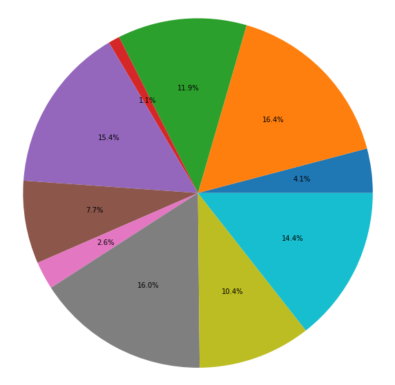
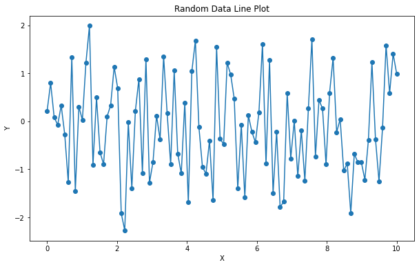
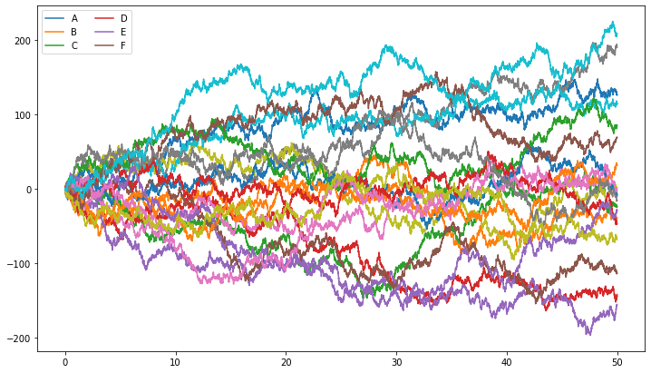
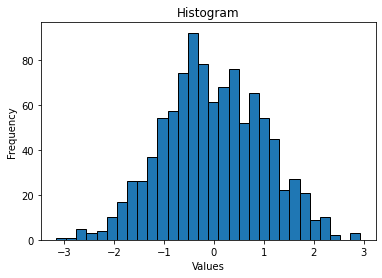
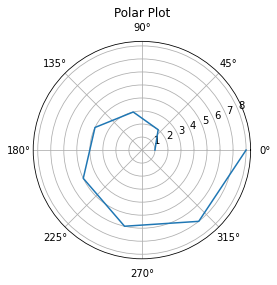
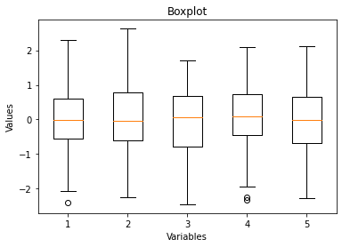
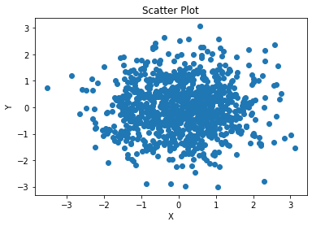
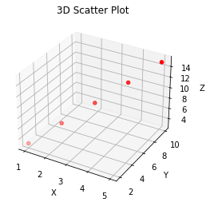

# 如何在JupyterLab中调用Intel的oneAPI实现数据可视化

## 一、新建文件

### 首先进入JupyterLab中，我们新建一个名为Matplotlib的ipynb文件，编译语言选择任意python均可

### 选择文件为Code，进行代码输入

## 二、绘图代码实现

### 首先我们需要先导入相应库，代码如下：


```python
import numpy as np
import matplotlib.pyplot as plt
import numpy as np
```

### 导入相应库后，我们可以使用Numpy库导入数据，代码如下


```python
# 使用NumPy读取CSV文件,data.csv是你的文件的路径
data = np.loadtxt('data.csv', delimiter=',', skiprows=1)
```

### 进行数据清理，此处只是示例，需要你根据实际情况进行数据清理


```python
# 提取x和y的值
x = data[:, 0]  # 第一列为x值
y = data[:, 1]  # 第二列为y值

# 数据清理示例（根据需要进行具体的数据清理操作）
# 1. 处理缺失值
x = np.nan_to_num(x)  # 将x中的NaN值转换为0或其他指定值
y = np.nan_to_num(y)  # 将y中的NaN值转换为0或其他指定值

min_value = 0
max_value = 100
# 2. 处理异常值
x = np.clip(x, min_value, max_value)  # 将x中小于最小值或大于最大值的值替换为最小值或最大值
y = np.clip(y, min_value, max_value)  # 将y中小于最小值或大于最大值的值替换为最小值或最大值

# 其他数据清理操作...
```

### 完成数据清理后，可以进行绘图了，下面我们通过几个简单的示例来说明如何使用Matplotlib里的绘图函数

## 三、数据可视化

### 1.绘制饼图


```python
import numpy as np
import matplotlib.pyplot as plt

# 生成随机数据
data = np.random.rand(10)

# 绘制饼图
plt.figure(figsize=(10, 10))
plt.pie(data, labels=None, autopct='%1.1f%%')
plt.axis('equal')  # 使饼图为正圆形

# 显示图表
plt.show()
```


    

    


### 2.绘制折线图


```python
import numpy as np
import matplotlib.pyplot as plt

# 生成随机数据
x = np.linspace(0, 10, 100)
y = np.random.randn(100)

# 绘制折线图
plt.figure(figsize=(10, 6))
plt.plot(x, y, marker='o', linestyle='-')

# 设置标题和轴标签
plt.title('Random Data Line Plot')
plt.xlabel('X')
plt.ylabel('Y')

# 显示图表
plt.show()
```


    

    


### 3.绘制曲线图


```python
import numpy as np
import matplotlib.pyplot as plt
%matplotlib inline
x = np.linspace(0, 50, 10000)
y = np.cumsum(np.random.randn(10000, 20), 0)
plt.figure(figsize=(12, 7))
plt.plot(x, y)
plt.legend('ABCDEF', ncol=2, loc='upper left')
```


    <matplotlib.legend.Legend at 0x7fc6591e1c40>


    

    


### 4.绘制直方图


```python
import matplotlib.pyplot as plt
import numpy as np

# 生成随机数据
data = np.random.randn(1000)

# 绘制直方图
plt.hist(data, bins=30, edgecolor='black')

# 设置标题和轴标签
plt.title('Histogram')
plt.xlabel('Values')
plt.ylabel('Frequency')

# 显示图表
plt.show()
```


    

    


### 5.绘制极坐标图


```python
import numpy as np
import matplotlib.pyplot as plt

# 生成数据
theta = np.linspace(0, 2 * np.pi, 8)
r = np.array([1, 2, 3, 4, 5, 6, 7, 8])

# 绘制极坐标图
plt.polar(theta, r)

# 设置标题
plt.title('Polar Plot')

# 显示图表
plt.show()
```


    

    


### 6.绘制箱线图


```python
import matplotlib.pyplot as plt
import numpy as np

# 生成随机数据
data = np.random.randn(100, 5)

# 绘制箱线图
plt.boxplot(data)

# 设置标题和轴标签
plt.title('Boxplot')
plt.xlabel('Variables')
plt.ylabel('Values')

# 显示图表
plt.show()
```


    

    


### 7.绘制散点图


```python
import matplotlib.pyplot as plt
import numpy as np

# 生成随机数据
x = np.random.randn(1000)
y = np.random.randn(1000)

# 绘制散点图
plt.scatter(x, y)

# 设置标题和轴标签
plt.title('Scatter Plot')
plt.xlabel('X')
plt.ylabel('Y')

# 显示图表
plt.show()
```


    

    


### 8.绘制3维坐标图


```python
import matplotlib.pyplot as plt
from mpl_toolkits.mplot3d import Axes3D

# 创建一个3D图形对象
fig = plt.figure()
ax = fig.add_subplot(111, projection='3d')

# 生成数据
x = [1, 2, 3, 4, 5]
y = [2, 4, 6, 8, 10]
z = [3, 6, 9, 12, 15]

# 绘制3D散点图
ax.scatter(x, y, z, c='r', marker='o')

# 设置标题和轴标签
ax.set_title('3D Scatter Plot')
ax.set_xlabel('X')
ax.set_ylabel('Y')
ax.set_zlabel('Z')

# 显示图形
plt.show()
```


    

    


## 四、结果分析

>经过以上演示，相信读者已经基本掌握了在JupyterLab中使用Matplotlib实现数据可视化的方法
>
>可以发现，虽然在python的任意编译器中（如：pycharm，VScode等）可以实现同样的功能，
>但使用oneAPI的Jupyter更加方便，我们不需要花大量时间和空间下载编译器和编译语言，也
>不需要苦于代码的跨平台实现，oneAPI为我们提供更加便利和顺畅的编程体验

## 五、使用oneAPI的理由

经过以上演示，可以发现oneAPI是一个开放、统一的编程模型，旨在简化并加速异构计算的开发过程。它具有以下优势：

>统一性：oneAPI提供了一种统一的编程模型，可以在不同类型的硬件加速器上进行开发，包括CPU、GPU、FPGA等。这意味着开发人员可以使用相同的代码库和工具来处理不同的硬件，从而降低了学习和开发成本。
>
>性能优化：oneAPI提供了丰富的优化工具和库，帮助开发人员充分利用底层硬件的计算能力。通过使用优化工具和库，开发人员可以实现更高效的并行计算和数据处理，从而获得更好的性能。
>
>可移植性：由于oneAPI是一个开放的标准，因此它可以在不同的硬件和操作系统上运行。这使得开发人员可以更轻松地将代码移植到不同的硬件平台上，而无需进行大量的修改。
>
>生态系统支持：oneAPI得到了众多硬件供应商、工具提供商和软件开发社区的支持。这意味着开发人员可以获得广泛的工具、库和技术支持，以帮助他们更好地开发和优化异构计算应用程序。

总体而言，oneAPI的优势在于它提供了一种统一的编程模型，促进了异构计算的开发和优化，提高了性能并增强了可移植性，同时受到了广泛的行业支持。

## 如何使用oneAPI

参考官方所给文档，作者在最后简要归纳一下oneAPI的大致使用方法：
使用oneAPI主要涉及以下步骤：

>安装oneAPI工具套件：首先，你需要从Intel或其他支持oneAPI的供应商处获取oneAPI工具套件。该套件通常包括编译器、调试器、性能分析工具、优化库等。安装过程会根据不同的供应商和操作系统而有所差异。
>
>编写代码：使用支持oneAPI的编程语言（如C++、Data Parallel C++等），编写你的应用程序代码。oneAPI提供了一组库和工具来帮助你实现并行计算、向量化和数据管理等功能。
>
>选择目标设备：根据你的需求和硬件平台的可用性，选择目标设备，例如CPU、GPU或FPGA。不同的设备可能需要使用不同的编译选项和指令集来进行优化。
>
>构建和编译：使用oneAPI提供的编译器和构建工具，将你的源代码编译成可执行文件。在编译过程中，你可以指定编译选项和优化参数来针对目标设备进行优化。
>
>调试和性能分析：使用oneAPI提供的调试器和性能分析工具，对你的应用程序进行调试和性能分析。这可以帮助你找出潜在的错误和瓶颈，并进行优化。
>
>运行和部署：将生成的可执行文件部署到目标设备上运行。确保目标设备上已经安装了相应的运行时库和驱动程序。

需要注意的是，具体的使用方式可能会因为使用的供应商和操作系统而有所差异。因此，在使用oneAPI之前，建议参考相关文档和示例代码，以了解适用于你的特定环境和需求的最佳实践。
